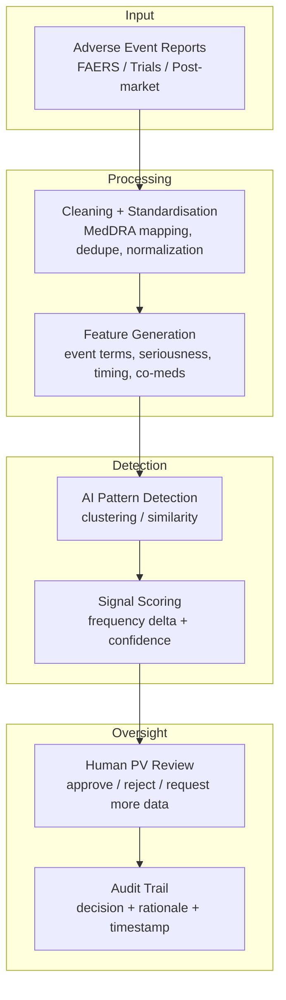

# AI Adverse Event Signal Detector

This project demonstrates how AI could assist pharmacovigilance and clinical safety teams by identifying potential safety signals in adverse event reports.

Adverse event monitoring is a critical component of clinical trials and post-market drug safety. Large volumes of safety reports must be reviewed to identify patterns that may indicate emerging safety risks.

AI systems can support this process by grouping similar events and highlighting patterns that require expert investigation.

---

## Problem

Safety teams often review thousands of adverse event reports across:

- clinical trials
- post-market surveillance
- spontaneous safety reporting systems

Detecting meaningful patterns early can be difficult and time-consuming.

Important signals may be hidden within large datasets of heterogeneous reports.

---

## Concept

This prototype demonstrates how AI could assist pharmacovigilance workflows by:

1. Ingesting adverse event reports
2. Processing and standardising event data
3. Detecting clusters of similar adverse events
4. Identifying potential safety signals
5. Flagging signals for expert pharmacovigilance review

---

## Example Workflow

---

## Example Output

The system produces structured signal summaries which include:

- suspected drug
- adverse event cluster
- signal strength
- confidence score
- supporting evidence
- recommended next steps

Example output can be found in:
sample_output.json

---

## Example Use Cases

AI-assisted safety monitoring could support:

- clinical trial safety monitoring
- pharmacovigilance signal detection
- regulatory safety review preparation
- drug risk management planning

---

## Governance Considerations

Safety signal detection must operate under strict regulatory oversight.

AI tools should:

- support expert reviewers rather than replace them
- provide transparent evidence linking
- maintain audit trails for review decisions
- flag uncertain signals for human validation

This design follows a **human-in-the-loop model** where AI highlights patterns but **final safety assessments remain with pharmacovigilance professionals.**

---

## Disclaimer

This project is a conceptual prototype demonstrating AI workflows for safety signal detection.  
It uses simplified example data and is not intended for clinical or regulatory decision-making.
