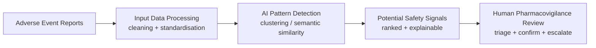
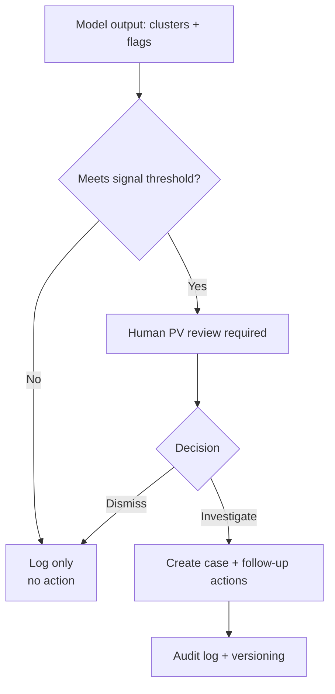

# System Architecture (Concept)

This prototype shows how AI could help pharmacovigilance teams surface **potential safety signals** from adverse event (AE) reports, while keeping **human PV review** as the decision gate.

---

## End-to-end workflow

# What each stage does

Input Data Processing: de-duplicate, normalise terms (e.g., MedDRA-like grouping), basic QC checks.

AI Pattern Detection: group similar events, detect unusual clusters, trend shifts, or severity spikes.

Potential Safety Signals: output a ranked list with reasoning features (why it was flagged).

Human PV Review: confirm signal, request more data, open investigation, or dismiss as noise.

# Guardrails (regulated mindset)

**Note:** This is a conceptual workflow using example data. It is not a validated pharmacovigilance system and should not be used for safety decisions.
