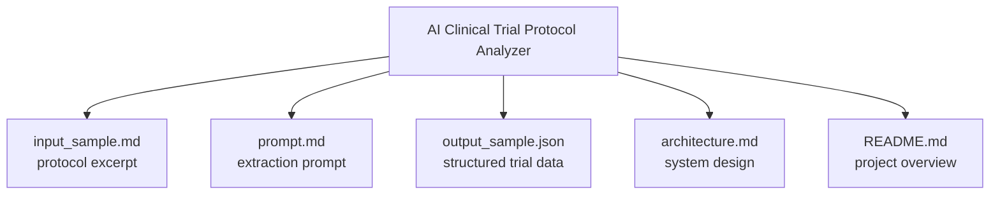
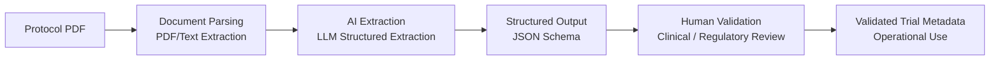

# AI Clinical Trial Protocol Analyser

This project demonstrates how AI can extract structured information from clinical trial protocols to support clinical operations and regulatory review.

Clinical protocols are typically long, complex documents that require manual review across multiple teams. This prototype shows how a Large Language Model (LLM) could assist by converting unstructured protocol text into structured data.

## Problem

Clinical trial protocols contain critical information such as:

- study design
- eligibility criteria
- treatment regimens
- endpoints
- safety monitoring

Extracting this information manually is time-consuming and error-prone.

AI-assisted extraction can help accelerate trial planning and review workflows.

## Solution

This prototype implements a simple pipeline:

1. Protocol text input
2. Prompt-based AI extraction
3. Structured JSON output
4. Human validation layer

## Project Structure

## Architecture Concept

  
## Example Output

The system extracts key protocol components including:

- trial metadata
- study design
- endpoints
- eligibility criteria
- treatment arms
- operational considerations
- safety monitoring

It also includes:

- evidence snippets linking extracted fields to source text
- confidence scoring
- human-review flags
- regulatory risk indicators

## Governance Considerations

Clinical trial protocols exist within regulated environments.

For this reason the system includes safeguards:

- evidence traceability
- human validation requirements
- confidence scoring
- regulatory risk flags

This ensures AI is used as **decision support rather than automated decision-making**.

## Potential Applications

This approach could support:

- clinical trial feasibility analysis
- protocol review workflows
- clinical operations planning
- regulatory document summarization
- health AI product development

## Disclaimer

This project is a prototype demonstration using publicly available protocol excerpts. It is not intended for use in regulated clinical decision-making.
