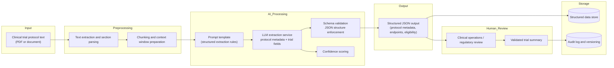

## System Architecture Overview

This prototype demonstrates how an AI-assisted workflow could support clinical trial protocol analysis.

Clinical trial protocols are complex documents that must be manually reviewed by clinical operations, regulatory teams, and investigators. This system illustrates how large language models could help convert unstructured protocol text into structured operational data.

The architecture consists of several stages:

### Input Processing
Protocol documents are first parsed and segmented into structured text sections. This improves model accuracy by providing focused context windows.

### AI Extraction Layer
A prompt template defines the structured fields to extract, such as:

- protocol metadata
- trial phase and indication
- endpoints
- eligibility criteria
- treatment arms
- operational schedules

The large language model performs structured extraction and returns data in JSON format.

### Validation and Confidence Scoring
Outputs are validated against a predefined schema to ensure structured consistency.

Confidence scoring highlights uncertain or ambiguous fields requiring human verification.

### Human Review Layer
Because clinical trial protocols operate in regulated environments, AI outputs must be reviewed by domain experts before use.

Clinical operations or regulatory teams review flagged sections and confirm extracted data.

### Storage and Auditability
Validated outputs can be stored in structured data systems while maintaining:

- version history
- audit logs
- traceability to source text

This approach enables AI-assisted protocol review while maintaining the governance and oversight required in clinical research.
