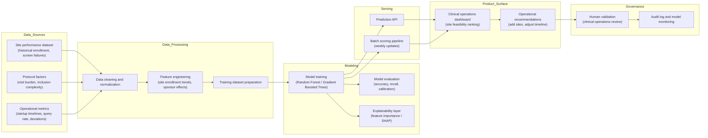

# System Architecture (Concept)

This prototype demonstrates how machine learning could support clinical trial site selection by predicting recruitment feasibility using historical operational data.

