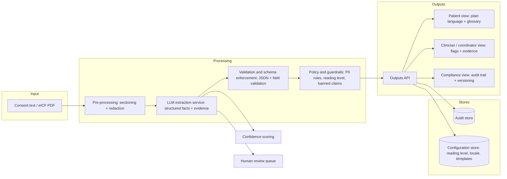

```mermaid
flowchart LR

subgraph Input
A["Consent text / eICF PDF"]
end

subgraph Processing
B["Pre-processing: sectioning + redaction"]
C["LLM extraction service: structured facts + evidence"]
D["Validation and schema enforcement: JSON + field validation"]
E["Policy and guardrails: PII rules, reading level, banned claims"]
end

subgraph Outputs
F["Outputs API"]
I["Patient view: plain language + glossary"]
J["Clinician / coordinator view: flags + evidence"]
K["Compliance view: audit trail + versioning"]
end

subgraph Stores
L[("Audit store")]
M[("Configuration store: reading level, locale, templates")]
end

A --> B
B --> C
C --> D
D --> E
E --> F

C --> G["Confidence scoring"]
C --> H["Human review queue"]

F --> I
F --> J
F --> K

F --> L
F --> M
```
