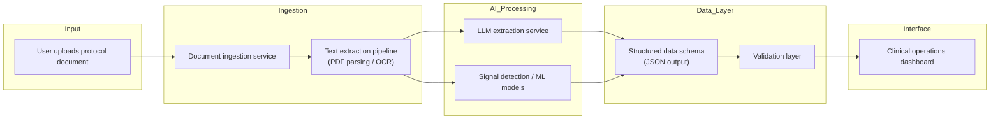

# Example System Architecture

```mermaid
flowchart LR

subgraph Input
A["User uploads protocol document"]
end

subgraph Ingestion
B["Document ingestion service"]
C["Text extraction pipeline<br/>(PDF parsing / OCR)"]
end

subgraph AI_Processing
D["LLM extraction service"]
E["Signal detection / ML models"]
end

subgraph Data_Layer
F["Structured data schema<br/>(JSON output)"]
G["Validation layer"]
end

subgraph Interface
H["Clinical operations dashboard"]
end

A --> B
B --> C
C --> D
C --> E

D --> F
E --> F

F --> G
G --> H
```
